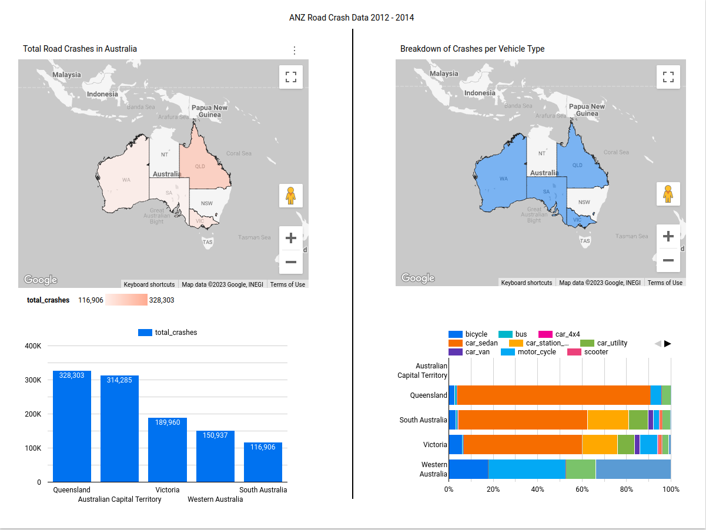

## __Dataset__
ANZ Road Crash Dataset
https://www.kaggle.com/datasets/mgray39/australia-new-zealand-road-crash-dataset

Alternatively hosted in this link: https://storage.googleapis.com/de-final-project-381710_fp-data-lake/anz_road_crash_data/source/anz_road_crash.zip

## __Dashboard__
[](https://lookerstudio.google.com/reporting/27264f64-530f-4b14-9720-df6df4a42747/page/0LtMD)

## __Problem Statement__
Be able to create an end-to-end data pipeline that involves the following
1. Create an data pipeline that retrieves data from a source, performing initial data cleaning such that the format is compatible to the destination data lake.
2. Perform initial cleaning and standardization of data that gets uploaded to a data warehouse
3. Perform transformations on raw data to be able to provide the needed data to dashboards
4. Create a dashboard that consumes the transformed views of the raw data

## __Technology Stack__

### Data lake (Staging storage)
* Google Cloud Store

### Task Orchestration
* Prefect

### Data Transformation
* dbt
* Spark (data exploration) in jupyter notebooks

### Data Warehouse
* Google BigQuery

### Dashboard
* Google Looker Studio

### Infrastructure as Code
* Terraform

## __Required Software__
1. Python 3.10.x
2. Poetry (1.3.2)
3. Docker + Compose
4. Terraform
5. gcloud (Install it from here https://cloud.google.com/sdk/docs/install)

## __Initial Setup__
* Create a Google Cloud Platform (GCP) account.
    1. After creating a GCP account, create a new project. Take note of your project ID.
    2. Create a new Service Account.
    3. Assign the Roles `BigQuery Admin`, `Storage Admin`, `Storage Object Admin` and `Viewer` Roles to your service account.
    3. Download and save your service account json file in a secure folder.

* Set virtualenv to be created inside project folder.

    Execute `poetry config virtualenvs.in-project true`

* After building the prefect Docker image, install the GCP block

    1. cd into infrastructure docker directory: `cd infrastructure/docker`
    2. run the prefect agent and server: `prefect compose up prefect`
    3. cd into `application` directory `cd ../../application`
    4. Make sure poetry and virtualenvs.in-project confid has been setup. Then execute `poetry install`. This should create a `.venv` folder which contains the dependencies including `prefect_gcp`
    5. Then run `poetry run prefect block register -m prefect_gcp`

* Add the Google Service Account credentials in the `GCP Credentials` block in prefect

* Authenticate GCP. Execute `gcloud auth application-default login`


## __Setup__
1. Build docker images in infrastructure
2. Deploy GCS and BigQuery infrastructure terraform

    a. cd into `infrastructure/terraform`

    b. in `terraform.tfvars`, modify `project_name` to the one you created earlier under __Initial Setup__. Also set the appropriate region. See https://cloud.google.com/compute/docs/regions-zones

    c. Execute `terraform init`, then `terraform apply -auto-approve` to create the GCS and dataset for bigquery

3. Run Prefect agent locally

    a. cd into `infrastructure/docker`

    b. Execute `docker compose up prefect`

4. Run the Data loading pipeline

    a. cd into `application/`

    b. Execute `poetry run etl_app`

5. Run the dbt transformations

    a. cd into `application/dbt_transformation`

    b. create a file called `credentials.env` with the following contents
    ```
    set -a
    export DBT_BQ_PROJECT=<PROJECT ID> \
       DBT_BQ_DATASET=anz_road_crash_dataset \
       DBT_BQ_KEYFILE=<ABSOLUTE PATH TO SERVICE ACCOUNT ACCESS JSON FILE>
    ```

    b. Install dbt utils dependencies. Execute `poetry run dbt deps`

    c. Run Transformations. Execute `(source ./credentials.env && poetry run dbt run)`

6. You should end up with a BigQuery Datawarehouse with intermediate data and data marts. From this you can create a dashboad that looks like the following:
https://lookerstudio.google.com/reporting/27264f64-530f-4b14-9720-df6df4a42747/page/0LtMD

## __Data Explored__
1. Total Crashes per vehicle type (Done)
2. Total Crashes per vehicle type per state (Done)
3. Total Crashes per state (Done)

## Planned Data Exploration and Visualizations
4. Total Casualties, fatalities, major/minor injuries per vehicle type
5. Total Casualties, fatalities, major/minor injuries per state
6. Total crashes that involves the following conditions
    * road conditions
    * drug/alcohol related
    * environment conditions
    * locations

## Method
* Batch Processing using Prefect

## Requirements
1. GCP account, with project and service account with Storage Admin, Storage Object Admin and BigQuery Admin permissions with access key file downloaded
2. Prefect with GCP Block
    * `poetry add prefect-gcp`
    * `poetry run prefect block register prefect_gcp.credentials`
    * add access service account access key to the block

### Application:
1. ETL Code from data source to GCS
2. ETL code from GCS to Data warehouse
3. DBT code to transform/create views in data warehouse
4. A Dashboard to do analytics

### Accompanying Data Dictionary
* More information on the columns can be found here: https://github.com/mgray39/anz-crash/blob/master/Australian%20%26%20New%20Zealand%20Road%20Crash.ipynb
